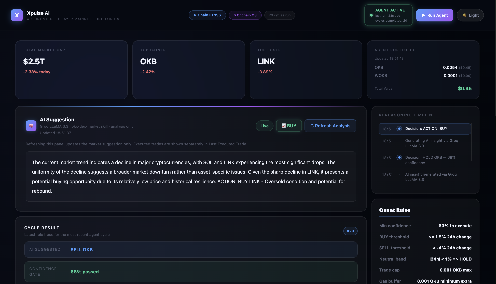
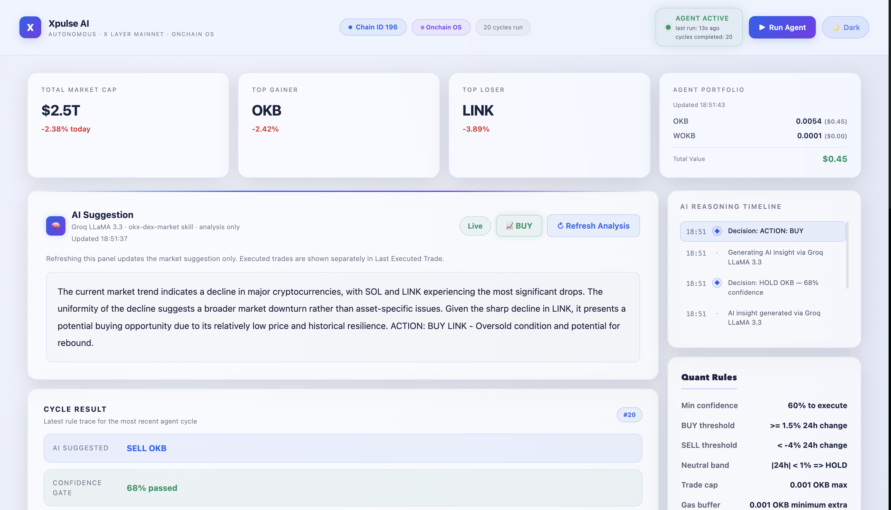
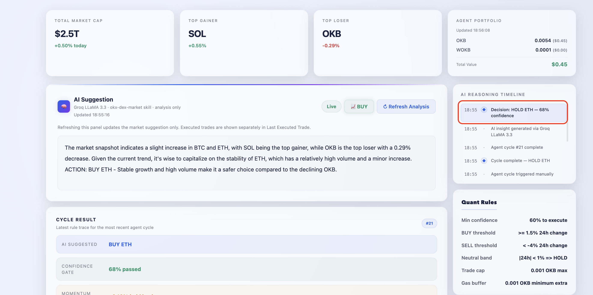
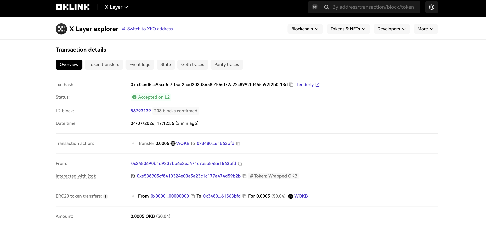

# ⚡ Xpulse AI — Autonomous Crypto Trading Agent on X Layer

> **Build X Hackathon 2026** · X Layer Arena · Autonomous AI Agent · Onchain OS Skills

[](https://www.oklink.com/xlayer)
[](https://github.com/okx/onchainos-skills)
[](https://groq.com)
[](https://nextjs.org)
[](LICENSE)

---

## Quick Demo

| | |
|---|---|
| **Live Dashboard** | [https://xpulse-ai.vercel.app](https://xpulse-ai.vercel.app) |
| **Onchain Transaction** | [View on X Layer Explorer](https://www.oklink.com/xlayer/tx/0x6f7ff5594b8adbbc7cfc4cb2e105bb18297d795786e00825d3ed47bde7144f86) |
| **Demo Video** | [Watch on YouTube](https://youtube.com/YOUR_VIDEO_LINK) |

## X Layer Arena Compliance

**Live Deployment:** [https://xpulse-ai.vercel.app](https://xpulse-ai.vercel.app)  
**Network:** X Layer Mainnet  
**Chain ID:** 196  
**Onchain Identity / Agent Wallet Address:** `0x3480690b1D9337Bb6e3ea471C7a5a84861563Bfd`  
**Explorer:** [View Agent Wallet](https://www.oklink.com/xlayer/address/0x3480690b1D9337Bb6e3ea471C7a5a84861563Bfd)

### Core Onchain OS Skills Used
- `okx-agentic-wallet` for autonomous signing and transaction submission
- `okx-dex-swap` for routed token swaps on X Layer
- `okx-dex-market` for market context and token intelligence

### Autonomous Agent Role
- Single-agent system
- The agent analyzes market data, applies quant risk rules, and executes trades on X Layer through its dedicated onchain wallet

### Onchain Proof
- All executed transactions are publicly verifiable on OKLink
- Example transaction: [View confirmed X Layer transaction](https://www.oklink.com/xlayer/tx/0x52191bcb29879e419ee7a554caf8e2046ec7732ee1a33e1ef60a9c80d8643563)

---

### Agent Execution Example

```
════════════════════════════════════════════
  XPULSE AI AGENT CYCLE — 2026-04-06T03:11:40.547Z
  Network: X Layer Mainnet (Chain ID 196)
  Skills:  okx-agentic-wallet · okx-dex-swap · okx-dex-market
  Max trade: 0.001 OKB per cycle
════════════════════════════════════════════
[1/4] Fetching market data...
[2/4] Detecting top movers...
[3/4] Generating AI insight via Groq LLaMA 3.3...
AI Signal: ETH shows strong momentum with 3.56% 24h gain and rising volume.
           ACTION: BUY ETH — strong momentum among available tokens.
[4/4] Evaluating decision...
Decision: { action: 'BUY', asset: 'ETH', confidence: 85 }
[Agent] Confidence 85% ≥ 60% → executing live trade
[OnchainOS] Skill: okx-agentic-wallet + okx-dex-swap
[OnchainOS] Route: OKB → ETH | 0.0005 OKB
[OnchainOS] Submitted: 0xabc123...
[OnchainOS] ✅ Confirmed: 0xabc123...
[OnchainOS] Explorer: https://www.oklink.com/xlayer/tx/0xabc123...
✅ Cycle complete
```

---

## 1. Project Introduction

**Xpulse AI** is a fully autonomous crypto trading agent built on **X Layer Mainnet** (Chain ID: 196). It combines AI-powered market analysis, quantitative risk management, and onchain execution into a single system that runs without human intervention after deployment.

The agent follows this pipeline on every cycle:

```
Market Data → AI Suggestion → Quant Risk Layer → Onchain Execution → Dashboard Update
```

1. Fetches live market data from CoinGecko
2. Sends data to **Groq LLaMA 3.3** for analysis and signal generation
3. Validates the AI decision through a **Quant Risk Layer**
4. Executes confirmed trades onchain using **Onchain OS Skills** via an **Agentic Wallet**
5. Records the transaction and updates the live dashboard

Every trade is confirmed onchain and verifiable on the X Layer Explorer. The project shows that AI agents can operate autonomously, safely, and transparently on a high-performance EVM Layer 2.

---

## 2. Why Autonomous Agents on X Layer

Most crypto tools still require a human to approve every action. Autonomous agents change that by handling the full decision-and-execution loop onchain, without waiting for human input.

X Layer is a strong environment for this because it offers low fees, fast finality, and tight integration with the OKX ecosystem. An agent running here can react to market conditions in real time — fetching data, generating a signal, validating risk, and executing a trade — all within a single automated cycle.

The key advantages of running an agent onchain rather than in a traditional backend:

- **Transparent execution** — every trade is a public transaction anyone can verify
- **Autonomous decision-making** — no human needed once the agent is deployed
- **Composable with DeFi** — the agent interacts directly with DEX infrastructure on X Layer
- **Trustless operation** — the agent's logic is open source and its actions are onchain

Xpulse AI demonstrates what this looks like in practice: a running agent that reads the market, makes decisions, and executes trades — entirely on its own.

---

## 3. Agent Capabilities

Xpulse AI is not just a dashboard or a market tracker. It is a working agent that takes actions autonomously. Here is what it can do:

- **Analyze market data** — fetches live prices, 24h changes, and volume for multiple tokens from CoinGecko
- **Generate AI trading signals** — uses Groq LLaMA 3.3 to produce structured market insights with explicit BUY / SELL / HOLD decisions
- **Apply quant risk rules** — every AI signal is validated against confidence thresholds, momentum checks, and balance limits before execution
- **Execute onchain trades** — submits real transactions on X Layer Mainnet using the okx-agentic-wallet and okx-dex-swap skills
- **Maintain portfolio state** — tracks live OKB and WOKB balances with USD values, fetched server-side to avoid CORS issues
- **Record transaction history** — stores the latest confirmed transactions in persistent agent storage, exposed through API routes
- **Update the dashboard automatically** — the frontend polls for new data every 5 seconds so the UI reflects agent activity in near real time

---

## 4. Key Features

| Feature | Description |
|---|---|
| 🤖 Autonomous AI Agent | Full trading cycle with no human input required |
| 🧠 AI Market Analysis | Groq LLaMA 3.3 70B generates insights and trading signals |
| ⚙️ Quant Risk Layer | Numeric safety rules validate every decision before execution |
| 🔗 Onchain Execution | Real trades via Onchain OS Skills on X Layer Mainnet |
| 👛 Agentic Wallet | `okx-agentic-wallet` signs and submits transactions autonomously |
| 📊 Live Dashboard | Glassmorphism UI — dark/light mode, auto-refresh every 5 seconds |
| 💼 Portfolio Tracking | Live OKB and WOKB balances with USD value |
| 📋 Activity History | Last 10 onchain transactions with clickable explorer links |
| ⏱ AI Reasoning Timeline | Timestamped log of every agent decision and action |
| 🔁 Execution Modes | Supports local CLI execution and production-safe manual triggering via the dashboard Run Agent button |

---

## 5. Architecture Overview

Xpulse AI uses a **hybrid decision architecture** that separates AI reasoning from onchain execution with a quantitative risk layer between them.

The AI generates a trading signal, but that signal only reaches the blockchain if it passes every risk check. This makes the agent safer and more disciplined than a system that acts on raw AI output alone.

```
┌──────────────────────────────────────────────────────────────┐
│                      XPULSE AI SYSTEM                         │
│                  Build X Hackathon 2026                        │
├─────────────┬──────────────┬──────────────┬──────────────────┤
│ DATA LAYER  │  AI LAYER    │ QUANT RISK   │ EXECUTION LAYER  │
│             │              │ LAYER        │                  │
│ CoinGecko   │ Groq LLaMA   │              │ X Layer Mainnet  │
│ Live Prices │ 3.3 70B      │ Confidence   │ Agentic Wallet   │
│ 24h Movers  │              │ Threshold    │ Onchain OS       │
│ Volume Data │ Alpha Signal │ Momentum     │ okx-dex-swap     │
│             │ Generation   │ Check        │ okx-dex-market   │
├─────────────┴──────────────┴──────────────┴──────────────────┤
│                  NEXT.JS GLASSMORPHISM DASHBOARD               │
│   Agent Status · AI Insights · Portfolio · TX History         │
└──────────────────────────────────────────────────────────────┘
         ▲                                         │
         └────── Cron / Loop (every 15 min) ───────┘
```

---

## 6. Architecture Diagram

```
                        XPULSE AI AGENT FLOW
                        ─────────────────────

          ┌─────────────────────────────────┐
          │         MARKET DATA             │
          │    CoinGecko API — Live Prices  │
          └────────────────┬────────────────┘
                           │
                           ▼
          ┌─────────────────────────────────┐
          │          AI ENGINE              │
          │  Groq LLaMA 3.3 — 70B Model    │
          │  Generates: BUY / SELL / HOLD   │
          └────────────────┬────────────────┘
                           │
                           ▼
          ┌─────────────────────────────────┐
          │       DECISION ENGINE           │
          │  Parses AI signal + asset       │
          │  Maps decision to swap route    │
          └────────────────┬────────────────┘
                           │
                           ▼
          ┌─────────────────────────────────┐
          │      QUANT RISK LAYER  ⚠        │
          │  Confidence ≥ 60% check         │
          │  Price momentum validation      │
          │  Balance safety check           │
          │  Trade size enforcement         │
          └────────────────┬────────────────┘
                           │
                 ┌─────────┴──────────┐
                 │ PASS               │ FAIL
                 ▼                    ▼
    ┌────────────────────┐    ┌──────────────────┐
    │  ONCHAIN EXECUTION │    │   HOLD — SKIP    │
    │  Onchain OS Skills │    │  Log reason      │
    │  okx-agentic-wallet│    └──────────────────┘
    │  okx-dex-swap      │
    └─────────┬──────────┘
              │
              ▼
    ┌────────────────────┐
    │  X LAYER MAINNET   │
    │  Chain ID: 196     │
    │  TX Confirmed ✅   │
    └─────────┬──────────┘
              │
              ▼
    ┌────────────────────┐
    │  DASHBOARD UPDATE  │
    │  Store TX hash     │
    │  Update portfolio  │
    │  Refresh timeline  │
    └────────────────────┘
```

---

## 7. How the Agent Works

### Step 1 — Fetch Market Data
The agent calls the CoinGecko API and retrieves live prices, 24h percentage changes, and volume data for BTC, ETH, OKB, SOL, and LINK.

### Step 2 — AI Suggestion
Market data is sent to **Groq LLaMA 3.3** with a structured prompt. The model analyzes price momentum, volume trends, and relative performance. It produces a brief market insight followed by an explicit action signal:

```
ACTION: BUY ETH - Strong momentum with 3.56% gain and rising volume
```

### Step 3 — Decision Engine
The decision engine parses the AI output and maps it to a concrete swap route:

| AI Decision | Swap Route |
|---|---|
| `BUY ETH` | OKB → ETH |
| `BUY USDC` | OKB → USDC |
| `SELL ETH` | ETH → USDC |
| `BUY OKB` | OKB → WOKB (wrap) |
| `HOLD` | No transaction |

### Step 4 — Quant Risk Validation
The decision passes through the quant risk layer before any transaction is submitted. See [Section 8](#8-quant-risk-rules) for the full rule set.

### Step 5 — Onchain Execution
If the decision clears all risk checks, the agent submits the trade using **Onchain OS Skills**. The `okx-agentic-wallet` skill handles signing, and `okx-dex-swap` routes the transaction through the OKX DEX aggregator on X Layer.

### Step 6 — Record and Display
The confirmed transaction hash is persisted in the agent store and exposed through `/api/transactions`. The dashboard polls every 5 seconds and displays new activity automatically.

---

## 8. Quant Risk Rules

Between the AI decision and onchain execution sits a safety layer that applies numeric rules to every signal. The AI can generate a BUY or SELL suggestion, but it only reaches the blockchain if it meets all of the following conditions:

| Rule | Threshold | Action if Failed |
|---|---|---|
| **Confidence Threshold** | AI confidence < 60% | HOLD — signal too weak to trade |
| **Momentum Check** | 24h price change < 3% on a BUY signal | Downgrade to HOLD |
| **Balance Safety** | Wallet OKB < trade amount + 0.001 gas buffer | HOLD — insufficient funds |
| **Trade Size Cap** | Any amount > 0.001 OKB | Hard capped to 0.001 OKB |
| **Network Verify** | RPC returns wrong chain ID | Abort — prevents wrong-network trades |
| **Volatility Guard** | High volatility + confidence < 70% | Trade skipped or size reduced |

This layer exists because raw AI output is probabilistic, not deterministic. By adding numeric constraints, the agent avoids acting on uncertain signals and protects against common failure modes like low-confidence noise or insufficient balance.

---

## 9. Onchain OS Skill Usage

Xpulse AI integrates three official **Onchain OS Skills** from the OKX ecosystem:

### `okx-agentic-wallet`
The core execution skill. Manages the autonomous wallet that signs and submits all transactions without human approval. The wallet connects directly to X Layer Mainnet RPC using the agent's private key from environment variables.

```typescript
// Agent wallet connects to X Layer and signs autonomously
const wallet  = getAgentWallet(); // from okx-agentic-wallet skill pattern
const tx      = await wokb.deposit({ value: ethers.parseEther("0.0005") });
const receipt = await tx.wait();
```

### `okx-dex-swap`
Handles token swaps beyond OKB wrapping. Calls the OKX DEX Aggregator API (`/api/v6/dex/aggregator/swap`) to get optimized swap calldata, handles ERC-20 approvals, and submits the signed transaction.

```typescript
// OKX DEX API returns best route and calldata
// Agent wallet signs and submits directly to X Layer
const swapTx = await wallet.sendTransaction({
  to:    swapData.to,
  data:  swapData.data,
  value: BigInt(swapData.value),
});
```

### `okx-dex-market`
Provides access to OKX DEX market data on X Layer, including token prices, liquidity, and trading pairs. Used to enrich the context sent to the AI for analysis.

---

## 10. Deployment Details

| Field | Value |
|---|---|
| **Network** | X Layer Mainnet |
| **Chain ID** | 196 |
| **RPC URL** | `https://rpc.xlayer.tech` |
| **Explorer** | `https://www.oklink.com/xlayer` |
| **Native Token** | OKB |
| **Frontend** | Vercel (Next.js 14) |
| **Agent Runner** | Dashboard-triggered `/api/agent` execution + local CLI runner |
| **AI Provider** | Groq — LLaMA 3.3 70B |
| **Market Data** | CoinGecko API |

### Token Addresses (X Layer Mainnet)

| Token | Address |
|---|---|
| WOKB | `0xe538905cf8410324e03a5a23c1c177a474d59b2b` |
| USDC | `0x74b7F16337b8972027F6196a17a631aC6de26d22` |
| WETH | `0x5A77f1443D16ee5761d310E38b62f77f726bC71c` |
| OKX DEX Router | `0xD1b8997AaC08c619d40Be2e4284c9C72cAB33954` |

---

## 11. Onchain Transaction Proof

All agent transactions are publicly verifiable on X Layer Mainnet.

### Confirmed Transactions

| TX Hash | Type | Network |
|---|---|---|
| [`0xca6c4f005a8a33dc0d32521cec98c47bbf68db796dcdb7a12bed8f0d1071cc53`](https://www.oklink.com/xlayer/tx/0xca6c4f005a8a33dc0d32521cec98c47bbf68db796dcdb7a12bed8f0d1071cc53) | WRAP OKB→WOKB | X Layer Mainnet |

| [`0xc6607a0aa4449fbd869a51003f4282847e21fdbdaa81fdd9e041d9e7d449c805`](https://www.oklink.com/xlayer/tx/0xc6607a0aa4449fbd869a51003f4282847e21fdbdaa81fdd9e041d9e7d449c805) | BUY ETH | X Layer Mainnet |

> 🔍 View all agent activity: `https://www.oklink.com/xlayer/address/0x3480690b1D9337Bb6e3ea471C7a5a84861563Bfd`

---

## 12. Dashboard

The dashboard is built with Next.js and styled with a glassmorphism design. It reads from the agent's persistent store and refreshes automatically every 5 seconds.

### What the dashboard shows

- **Agent Status** — live indicator showing whether the agent is active or idle, last run time, and total cycles completed
- **AI Suggestion Panel** — latest Groq market suggestion with BUY / SELL / HOLD output, displayed separately from executed trades
- **Portfolio Card** — real-time OKB and WOKB balances with USD value, fetched server-side
- **Last Executed Trade Card** — most recent confirmed onchain transaction with route, amount, and clickable explorer link
- **Onchain Activity Table** — latest confirmed agent transactions with hash, type, route, status, and timestamp
- **AI Reasoning Timeline** — timeline reconstructed from stored agent cycles and execution events
- **Run Agent Button** — triggers a full production-safe agent cycle through `/api/agent`


## Screenshots

### Dashboard (Dark Mode)


### Dashboard (Light Mode)


### AI Trading Decision


### Onchain Transaction Proof


---

## 13. Autonomous Execution

Xpulse AI supports two practical execution modes:

**Single cycle (local CLI)**  
Runs one complete agent cycle and exits. Useful for testing the full pipeline locally.

```bash
npx ts-node --project tsconfig.json scripts/run-agent.ts
```

**Production trigger (dashboard)**  
In the deployed Vercel app, the agent runs through the **Run Agent** button. This triggers `POST /api/agent`, which executes a full cycle:

1. Fetch market data
2. Generate Groq AI insight
3. Apply quant risk checks
4. Execute the onchain transaction if approved
5. Persist status and transaction history
6. Refresh the dashboard with the latest cycle output

> **Production note:** The live deployment uses persistent serverless storage for status and transaction history, making the dashboard compatible with Vercel's serverless environment. This keeps the submission safe for evaluation while still demonstrating real X Layer execution.

---

## 14. Setup Instructions

### Prerequisites

- Node.js v18 or v20
- A dedicated agent wallet (never use your main wallet)
- Real OKB on X Layer Mainnet (bridge from OKX exchange)
- Groq API key — free at [console.groq.com](https://console.groq.com)

### Installation

```bash
# Clone the repository
git clone https://github.com/ritesh59697/xpulse-ai.git
cd xpulse-ai

# Install dependencies
npm install

# Install Onchain OS Skills
npx skills add okx/onchainos-skills
# Select: okx-agentic-wallet, okx-dex-swap, okx-dex-market
```

### Configuration

```bash
cp .env.example .env.local
# Edit .env.local with your values
```

### Run Locally

```bash
npm run dev
# Open http://localhost:3000
```

### Deploy to Vercel

```bash
git push origin main
# Import repo at vercel.com
# Add environment variables in Vercel dashboard
# Connect Vercel KV / Redis storage
# Deploy and trigger live cycles from the Run Agent button
```

---

## 15. Environment Variables

```env
# ── X Layer Network ──────────────────────────────────────────
X_LAYER_NETWORK=mainnet
X_LAYER_RPC_URL=https://rpc.xlayer.tech
X_LAYER_CHAIN_ID=196
NEXT_PUBLIC_X_LAYER_NETWORK=mainnet

# ── Agent Wallet ─────────────────────────────────────────────
# Use a DEDICATED wallet — never your main wallet
AGENT_PRIVATE_KEY=0x...

# ── AI ───────────────────────────────────────────────────────
# Free at: https://console.groq.com
GROQ_API_KEY=gsk_...

# ── OKX DEX API (needed for token swaps beyond OKB wrapping) ─
# Free credentials: https://www.okx.com/web3/build/developer-center
OKX_API_KEY=your_api_key
OKX_SECRET_KEY=your_secret_key
OKX_PASSPHRASE=your_passphrase
OKX_PROJECT_ID=your_project_id

# ── Optional ─────────────────────────────────────────────────
# COINGECKO_API_KEY=CG-...
```

---

## 16. Project Structure

```
xpulse-ai/
├── .agents/
│   └── skills/
│       ├── okx-agentic-wallet/       ← Onchain OS agentic wallet skill
│       ├── okx-dex-swap/             ← Onchain OS DEX swap skill
│       └── okx-dex-market/           ← Onchain OS market data skill
├── src/
│   ├── app/
│   │   ├── page.tsx                  ← Glassmorphism dashboard
│   │   └── api/
│   │       ├── market/route.ts       ← CoinGecko market data proxy
│   │       ├── insight/route.ts      ← Groq AI insight endpoint
│   │       ├── agent/route.ts        ← Agent cycle trigger endpoint
│   │       ├── status/route.ts       ← Real-time agent status
│   │       ├── transactions/route.ts ← Transaction history
│   │       └── portfolio/route.ts    ← Live wallet balances (server-side)
│   ├── agent/
│   │   └── xpulse-agent.ts           ← Core agent logic ⭐
│   └── lib/
│       ├── xlayer.ts                 ← Network-aware X Layer helpers
│       └── agent-store.ts            ← KV-backed persistence with local JSON fallback
├── scripts/
│   └── run-agent.ts                  ← CLI runner with loop support
├── data/
│   ├── agent-status.json             ← Live agent state
│   └── agent-transactions.json       ← Transaction history (last 10)
├── .env.example
└── README.md
```

---

## 17. Hackathon Checklist

- [x] ✅ **Autonomous AI Agent** — full cycle with no human input
- [x] ✅ **X Layer Mainnet** — Chain ID 196, real OKB transactions
- [x] ✅ **Onchain OS Skills** — `okx-agentic-wallet`, `okx-dex-swap`, `okx-dex-market`
- [x] ✅ **Agentic Wallet** — signs and submits transactions autonomously
- [x] ✅ **Real Onchain Transactions** — verifiable on OKLink explorer
- [x] ✅ **AI Suggestion** — Groq LLaMA 3.3 with structured market reasoning
- [x] ✅ **Quant Risk Layer** — numeric safety rules protect against bad trades
- [x] ✅ **Live Dashboard** — glassmorphism UI, dark/light mode, 5s refresh
- [x] ✅ **Portfolio Tracking** — server-side balance fetch, no CORS issues
- [x] ✅ **Vercel Deployment** — live public URL with serverless persistence
- [x] ✅ **Autonomous Loop** — `AGENT_LOOP=true` for continuous operation
- [x] ✅ **Public GitHub** — open source with full documentation

---

## 18. Future Improvements

- **Expanded token support** — add more X Layer tokens as DEX liquidity grows
- **Multi-strategy engine** — run momentum, mean reversion, and trend-following strategies in parallel
- **Agent-to-agent interaction** — Xpulse interacts with other autonomous agents on X Layer
- **Portfolio rebalancing** — automatic allocation across OKB, ETH, USDC based on conditions
- **Risk-adjusted sizing** — dynamic trade size based on volatility and confidence scores
- **P&L dashboard** — historical performance tracking across agent cycles
- **Notification layer** — Telegram or Discord alerts when significant trades execute
- **Broader DEX coverage** — integrate more liquidity sources as X Layer ecosystem grows

---

## 19. Team

| Name | Role | X (Twitter) |
|---|---|---|
| Ritesh | Full Stack Developer & AI Agent Engineer | [@Ritesh5969](https://x.com/Ritesh5969) |

---

## License

MIT — Built for **Build X Hackathon 2026** · April 1–15, 2026

---

*Xpulse AI — autonomous market analysis, quantitative risk management, and onchain execution on X Layer.*
